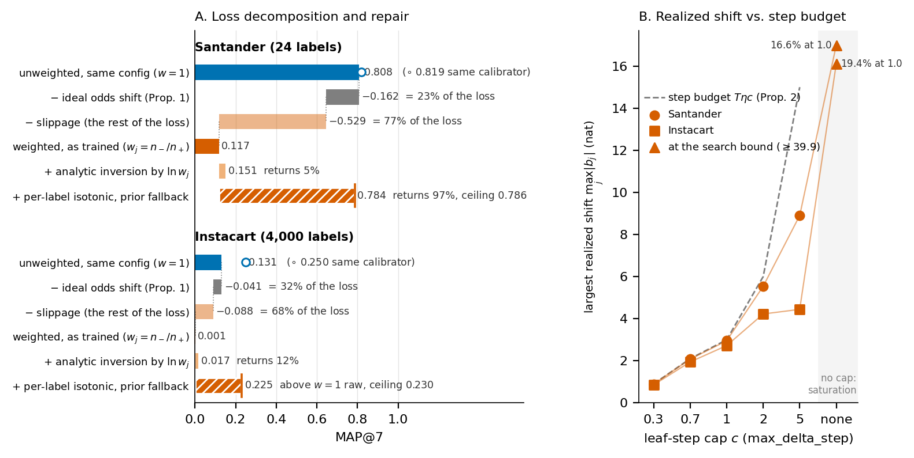
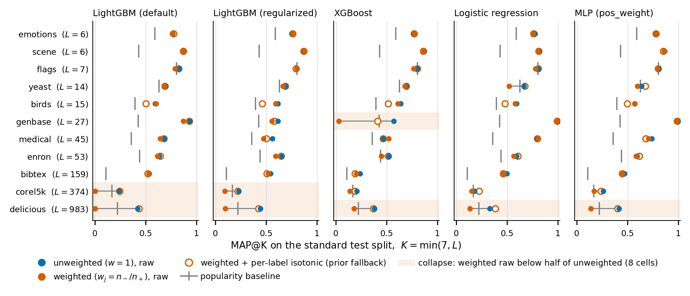

# Odds-Shift Slippage

This repository holds the code, the result files and the LaTeX source of

> **Odds-Shift Slippage in One-vs-Rest Rankers: Diagnosing and Repairing Reweighting-Induced Top-$K$ Errors**
> Akifumi Goto ([0009-0004-8305-6436](https://orcid.org/0009-0004-8305-6436)),
> Graduate School of Data Science, Shiga University, Hikone, Japan.
> 2026. arXiv preprint (identifier to be added).
> Code and results archived on Zenodo under the concept DOI [10.5281/zenodo.22719148](https://doi.org/10.5281/zenodo.22719148) (all versions; v0.4.0: [10.5281/zenodo.22719149](https://doi.org/10.5281/zenodo.22719149)).

**TL;DR.** A per-label class weight `scale_pos_weight = n_-/n_+` promises to shift each label's
log-odds by `ln w_j`; a finite one-vs-rest learner realizes something else, and the gap --
*odds-shift slippage* -- is most of what the weight costs a top-K ranking. On matched LightGBM pairs
the textbook shift explains 23% (Santander) and 32% (Instacart) of the loss; the analytic inversion
repairs only models that realized the shift *and* saturated nothing; per-label isotonic regression
with an explicit prior fallback repairs the rest, and the same collapse and repair reproduce on 11
public MULAN benchmarks and 5 learners. Don't reweight, calibrate -- and send dead labels to their
prior.





| Version | Where | Format |
|---|---|---|
| Canonical (arXiv) | [`publications/arxiv/`](publications/arxiv/) | acmart, 10 pages incl. references + supplement |
| ECIR 2027 submission | [`publications/ecir/`](publications/ecir/) | LNCS, 12 pages + references, anonymised |
| Archived long version | [`publications/full-paper/`](publications/full-paper/) | acmart, 14 + 7 pages, frozen |

See [`publications/README.md`](publications/README.md) for how the three share one set of numbers and
figures. The recipe is packaged as a small library:

```bash
pip install -e .            # oddslip: numpy + scikit-learn only
python -m pytest tests -q   # 4 tests
```

```python
from oddslip import predict_rank_loss, calibrate_per_label, select_calibrator_cv, apply_selection
d = predict_rank_loss(p_unweighted, w, y=y, k=7, p_weighted=p_weighted)      # what-if odds-shift share
p_rep, info = calibrate_per_label(p_cal, y_cal, p, prior=prior, fallback="prior", tau=0)
sel = select_calibrator_cv(p_cal, y_cal, prior, k=7); p_sel = apply_selection(sel, p_cal, y_cal, p, prior)
```

Every result number in the paper and in its supplement is either a macro or a cell in a generated
table body, both written by one script (`publications/shared/make_tables.py`) from the JSON files in
`artifacts/results/canonical/`.
The exceptions are few and named. Typed by hand in the `.tex` sources, and listed in `REPRODUCE.md`:
design constants (split fractions, the CI level, hyper-parameter values), the body rows of Supplement
Table S7, and the rounded "factor of 1.2" in the Limitations paragraph. Set by `make_tables.py` from
code rather than from a result file: six macros, named under Verify below. `make_bundle.sh` refuses
to pack the arXiv upload if the number gate fails (a plain `pdflatex` run does not call the gate).
The sections below say, in order, what can and cannot be re-run here, how to check the paper's
numbers in about a minute, what the paper claims, and where everything lives.

## What you can and cannot re-run

- **The Kaggle source files are not redistributed.** Santander's `train_ver2.csv` and the six
  Instacart CSVs stay under their competition terms; their SHA-256 values are in `DATA.md` and in
  `data/instacart/SHA256SUMS_raw.txt`, so a copy obtained from Kaggle can be checked against the one
  used here.
- **The prediction arrays are not shipped either, only hash-pinned.** The Santander and Instacart
  parts of `code/run_experiment.py` read fixed `.npz` prediction arrays rather than retraining; the
  all-product Instacart MLP arms instead read `.npy` float32 memmaps (`p_te_all.npy`, `p_va_all.npy`)
  through `code/chunked.py`, whose flag is `--outputs-dir`. The arrays are too large for a repository
  and are derived from Kaggle data. Their SHA-256 values are in
  `data/PRIMARY_ARRAYS.sha256` and in the `_meta.inputs` block of the result files that consumed
  them (`dead_label_frequency` is the one exception: it reads the arrays and pins none); for
  `run_experiment.py`, pass a directory holding them with `--arrays-dir`. The MULAN, leaf and
  synthetic parts need no arrays at all: they train small models from data fetched at run time
  (pinned by content hash in the result file) or generated from fixed seeds.
- **Three earlier Santander runs cannot be retrained from this repository.** The matched LightGBM
  pair (LGBM-w and LGBM-0, identical configuration, one script, one session) and every cap, dose and
  90%-draw arm are regenerated by `code/santander_train/train_matched_pair.py`; the Instacart
  LightGBM pair, its five leaf-step caps and its six 90%-draw arms by
  `code/instacart_train/build_features.py` (which writes the sparse feature and label bundle those
  arms read) followed by `code/instacart_train/train_matched_pair.py`; and all four MLP arms
  (Santander and Instacart, weighted and unweighted, plus the all-product Instacart arrays) by
  `code/instacart_train/train_mlp_posweight.py --dataset {santander,instacart} --configs w1,wr`.
  Three earlier runs are not: the WGBoost scorer of Supplement Table S1, the earlier run of the
  weighted configuration in Supplement Table S4 (the "no cap, earlier run" row) and the earlier
  unweighted 100-tree run of Supplement Table S2 come from scripts of the author's thesis pipeline
  that are not part of this release; `run_experiment.py` reads them from `uq_arrays.npz` and a second
  `predictions.npz` and hash-pins both. Their configurations are recorded in the paper, all three are
  robustness rows, and every headline number comes from the matched pairs.
- **Everything downstream of `artifacts/results/canonical/*.json` regenerates here in under a minute**, with no training
  and no arrays: the macro file, every table body, both main-text figures and the supplement figure.
- **One instrument note that matters for reproduction.** The Santander and Instacart prediction
  arrays are stored as single-precision probabilities, so on those two benchmarks a cell "at exactly
  1.0" means a raw margin of at least 17.3 nat, the float32 rounding threshold below one (the midpoint 1 - 2^-25 rounds up to 1.0). Every saturation share, tie attribution and
  identifiability count the paper reports **on Santander and Instacart** is therefore a property of
  the stored probability array — the object a deployed ranker consumes — and not a claim that the
  learner produced an infinite score (paper, Section 3). A pipeline that keeps the raw margin can
  still order those cells; a calibrator applied to the probabilities cannot. This does not apply to
  the MULAN, leaf-check and synthetic parts: they store no array, train in process and measure
  saturation in float64, so their saturation columns are not float32 artefacts (`DATA.md` §4).

## Verify the paper's numbers in one minute

```bash
sha256sum -c SHA256SUMS.txt            # every shipped file is intact
pip install -r requirements.txt        # the pinned versions; the JSON is byte-identical only under them
python publications/shared/verify_numbers.py   # regenerate the numbers, then check the prose
```

Run `verify_numbers.py` directly. It calls `make_tables.py` itself, so running `make_tables.py`
first would leave its staleness check nothing to detect. Three things happen:

1. `make_tables.py` rewrites `figures/numbers.tex`, `figures/numbers.json` and every
  `figures/tab_*.tex` from `artifacts/results/canonical/*.json`; the gate compares only `numbers.tex` and fails if the
   file that was on disk differed. The table bodies are rewritten as a side effect and never diffed,
   so a stale table body is caught by the `git status --porcelain publications/shared/figures` check below, not by
   the gate.
2. Every `\n...` macro used in the `main.tex` and `supplement.tex` of every version under `publications/` must be defined by that file.
3. The prose of both files is scanned for hand-typed result numbers.

Be exact about what step 3 can catch. Its pattern matches thousands-separated integers
(`2,538,132`), numbers with two or more decimals (`0.784`) and percentages (`23%`, `16.6%`). A bare
integer or a one-decimal number passes it, so those are not protected. It also skips any line that
pulls in a generated table body (`\input{figures/...}` or `\input figures/...`), and it whitelists an
explicit allow-list of design constants — split fractions, the CI level, hyper-parameter values, the
Instacart row and column counts, and a few theory constants — listed at the top of the script.
Six macros are written by
`make_tables.py` from code rather than derived from `artifacts/results/canonical/`: `\nnLabels` (24 Santander products),
`\nnSurveyImpl` (17 implementation rows of the dead-label survey in `docs/`), and the four instrument
constants `\nshiftSearchBound` and `\nshiftClipLogit` (the bisection bound and the logit clip of the
shift estimator) and `\nsatMarginF` and `\nsatMarginD` (the raw margin that "exactly 1.0" means in
single and in double precision, computed from the floating-point format itself). Everything else in
`figures/numbers.json` comes from a result file.

After the gate has run, `git status --porcelain publications/shared/figures` should be empty: that is the statement
that every macro and every table cell reproduced byte-for-byte from the shipped results.
`figures/numbers.json` is a flat key-to-value map of every macro, readable without LaTeX.

## What the paper shows

Ranking many binary labels within a row — a customer's next products, a document's tags — is
Bayes-optimal by the marginal probabilities. Training one-vs-rest models with a label-specific
positive-class weight (`scale_pos_weight = n_-/n_+`) shifts each label's log-odds by `ln w_j`, so the
model ranks by weighted odds instead, and the textbook says that shift can simply be inverted
afterwards. What a finite learner does with a weight in the thousands or millions, and which repair
then works, was unmeasured. We call the gap between the promised shift and the realized one
*odds-shift slippage*.

**The decomposition.** On Santander (2,538,132 test rows, 24 products) and Instacart (top-4,000
products), each with a LightGBM one-vs-rest pair and a shared-trunk MLP pair differing only in the
weights, MAP@7 falls from 0.808 to 0.117 on Santander and from 0.131 to 0.001 on Instacart. Applying
the ideal odds shift to the unweighted model reproduces only 23% of the Santander fall and 32% of the
Instacart one; the rest is slippage. Where the realized shift is identifiable at all, how much of it
the learners put in depends on how it is estimated: the median `b_j / ln w_j` is 0.88, 0.98 and 1.06
for the three pairs with enough identifiable labels to report one under the prevalence-matching
estimator, while a clipping-free estimator that reads a larger label set puts the two boosters at
0.78 and 0.50. Across both instruments the readings run from half the intended shift to 1.06 times
it, and none is the several-fold overshoot a bisection run against a clipped cell reports. On the
rest of the labels the realized shift is not large but undefined: cells saturate at exactly 1.0, and
no finite shift moves a cell that is already there.

**The repair.** Per-label isotonic regression returns Santander to 0.784, against an in-sample
ceiling of 0.786 — but only when labels without calibration positives are mapped to their prior
rather than passed through. The fallback, not the calibrator, decides the sign: on the unweighted
WGBoost scorer the same calibrator gives 0.434 with the identity fallback and 0.828 with the prior,
from a raw 0.776. A shared (pooled) map repairs nothing beyond tie resolution, since it cannot invert
a within-row order.

**The bound and the regime.** A leaf-step cap of `c` bounds the realized per-label shift by `T·eta·c`
(Proposition 2); a sweep of five caps on both benchmarks does not falsify it, and no cell saturates
under any cap. The analytic inversion is the repair that does not travel: among the weighted models
of Figure 2 it pays in exactly two, the two that realized the shift *and* saturated nothing. The
all-product Instacart MLP, which is not in that figure, meets the same two conditions and the
inversion pays there too (0.001 to 0.050), which is why the paper states them as conditions rather
than as a list of models. A synthetic study with known marginals reproduces the shift, its exact
inversion under a realizable learner, and its failure under saturation.

**The collapse reproduces on public data.** A sweep over 11 MULAN benchmarks and 5 learners — every
dataset in the MULAN distribution that ships a standard train/test split except the two largest,
tmc2007 and Corel16k — reaches a largest weight of 3,149 at `w = r`, three orders of magnitude below
Santander's 8,248,932, and still reproduces the collapse where the labels are many: the weight costs more than
half the score in 8 of 55 learner-dataset cells, 5 on delicious (every learner), 2 on Corel5k and 1
on genbase. Across the 10 learner cells of delicious and Corel5k, per-label calibration returns the
weighted model to within 0.028 of its unweighted arm under the same calibrator, while a shared map
never comes within 0.053 of it. Elsewhere the change is small and of either sign: 8 of the remaining
cells score higher with the weight than without, and the worst loses 0.146.

**The caveat travels with the repair.** Per-label calibration hurts an unweighted model where
calibration positives are scarce. Choosing among per-label maps, a shared map and no calibration by
cross-validation inside the calibration split removes that harm for the default learner and still
fails in 6 of 110 cells, where the calibration split does not predict the test file. The paper's
recipe is five ordered steps — estimate marginals unweighted, cap the leaf step if label-specific
weights are kept, calibrate on a split from the training period, send labels without calibration
positives to their prior, and choose the calibrator by cross-validation — and the three operations
that carry it are released as `oddslip`.

## Layout

```
publications/arxiv/       main.tex, supplement.tex, make_bundle.sh -- the canonical (arXiv) version
publications/ecir/        main.tex -- the anonymised LNCS version for ECIR 2027
publications/full-paper/  main.tex, supplement.tex -- the archived long version (frozen)
publications/shared/      figures/ (numbers.{tex,json}, every tab_*.tex, every fig*.pdf) shared by all versions
            make_tables.py   artifacts/results/canonical/*.json -> figures/numbers.{tex,json} and every tab_*.tex
            make_fig1.py (Fig. 1), make_fig_regime.py (Fig. 2), make_fig_mulan.py (Fig. 3), make_fig2.py (Supp. Fig. S1)
            verify_numbers.py (the number gate, run over every version)
code/       run_experiment.py (--dataset santander|instacart|santander_mlp|instacart_mlp, --part ...),
            datasets.py, chunked.py, learners.py, leaf_check.py, mulan_io.py, mulan_dose.py,
            synthetic_check.py, gate_check.py; every result file is produced here (code/README.md)
src/oddslip/             the released library and an executed tutorial notebook
code/santander_train/   train_matched_pair.py, io_data.py, train_models.py
code/instacart_train/   build_features.py, train_matched_pair.py, train_mlp_posweight.py, eda.py,
                        instacart_io.py, README.md (the next-basket formulation)
artifacts/results/canonical/    the JSON result files the paper is generated from. The array-consuming files pin their
            inputs by SHA-256 under _meta.inputs -- except dead_label_frequency, which reads the
            arrays but pins none; mulan_dose_response, mulan_tau_select and leaf_check pin their
            fetched ARFF/XML under fetch_provenance; gate_check hashes result files rather than
            arrays; the rest fetch or generate their inputs at run time and pin none
data/       PRIMARY_ARRAYS.sha256; the run_meta.json of every training run under santander/ and
            instacart/; instacart/results/eda.json; instacart/SHA256SUMS_raw.txt.
            No source data and no prediction arrays (see DATA.md)
docs/       dead_label_survey.md, the implementation survey behind Supplement Table S7
tests/      test_oddslip.py
scripts/    check_release_safety.py, the scan this repository is exported through
DATA.md         where every input comes from, what is pinned, what is not shipped
REPRODUCE.md    each paper element -> its result file -> the command that regenerates it
REPORT.md       a stub; that map now lives in REPRODUCE.md only
RELEASE_CHECKLIST.md  the pre-push checks and their expected output
requirements.txt      the pinned versions the result JSON is byte-identical under
CITATION.cff, LICENSE  citation metadata; MIT, code and documentation only
SHA256SUMS.txt  hash of every other file in this repository
```

## The `oddslip` library

`src/oddslip/` is the recipe as code, extracted from the scripts that produce the paper's numbers
and kept numerically identical to them. Three operations carry it:

- `predict_rank_loss` — the what-if device: apply the ideal odds shift to an unweighted model and
  report how much of a trained weighted model's top-K loss it explains (`odds_shift_share`) and how
  much is slippage.
- `calibrate_per_label` — per-label calibration in which the dead-label policy is an explicit
  argument (`fallback="prior" | "identity" | "exclude"`, with a positives threshold `tau`), never a
  silent pass-through. The prior is the training prevalence, not the calibration-split mean.
- `select_calibrator_cv` with `apply_selection` — the cross-validated choice among per-label maps at
  several thresholds, a shared map and no calibration, made inside the calibration split, never
  touching evaluation labels.

The package also exports the pieces those three are built from, because the paper's figures and
tables use them directly: `calibrate_shared`, `dead_labels`, `elkan_inversion`, `odds_shift`,
`map_at_k`, `logit` and `sigmoid`. It depends only on numpy and scikit-learn.
`src/oddslip/README.md` is the short usage document, `src/oddslip/tutorial.ipynb` an executed
notebook, and `pytest tests/test_oddslip.py` the test suite.

## Recompute from scratch

`REPRODUCE.md` is the table to work from: it maps each element of the paper to the result file that
produces it and to the command that regenerates that file, and it lists the fixed choices (splits,
seeds, MAP@K convention, dead-label policies, bootstrap settings) that every part shares. Install the
pinned versions first — `pip install -r requirements.txt`; the result JSON is byte-identical only
under those. Every run rewrites its file in `artifacts/results/canonical/` atomically, so `git diff artifacts/results/canonical/` afterwards
shows whether anything but the `_meta` timestamp moved.

To rebuild the PDFs:

```bash
python publications/shared/verify_numbers.py                    # macro file and table bodies (all versions)
(cd publications/shared && python make_fig1.py && python make_fig_regime.py && python make_fig2.py && python make_fig_mulan.py)
cd publications/arxiv                                           # or full-paper / ecir
for doc in main supplement; do
  pdflatex $doc && bibtex $doc && pdflatex $doc && pdflatex $doc
done
```

The supplement is built too because it travels with the upload as an ancillary PDF.
`make_bundle.sh` runs the gate and both of those builds itself (not the figure scripts — the figure
PDFs are shipped), packs the arXiv upload
(`main.tex`, `main.bbl`, the figures and table bodies `main.tex` actually pulls in, and the compiled
supplement as the ancillary file `anc/supplement.pdf`), and compiles the packed copy standalone as a
check.

## Citation and license

AI tools (Claude, Codex) were used for coding, language editing and manuscript review, as disclosed in the paper's
Acknowledgments; every analysis, number and citation was produced or verified by the author.

Every release is archived on Zenodo under the concept DOI [10.5281/zenodo.22719148](https://doi.org/10.5281/zenodo.22719148); v0.4.0 is [10.5281/zenodo.22719149](https://doi.org/10.5281/zenodo.22719149), and v0.4.1 (the arXiv text) is [10.5281/zenodo.22721960](https://doi.org/10.5281/zenodo.22721960).

See `CITATION.cff`. Code and documentation are under the MIT license (`LICENSE`); the datasets keep
their own terms.
